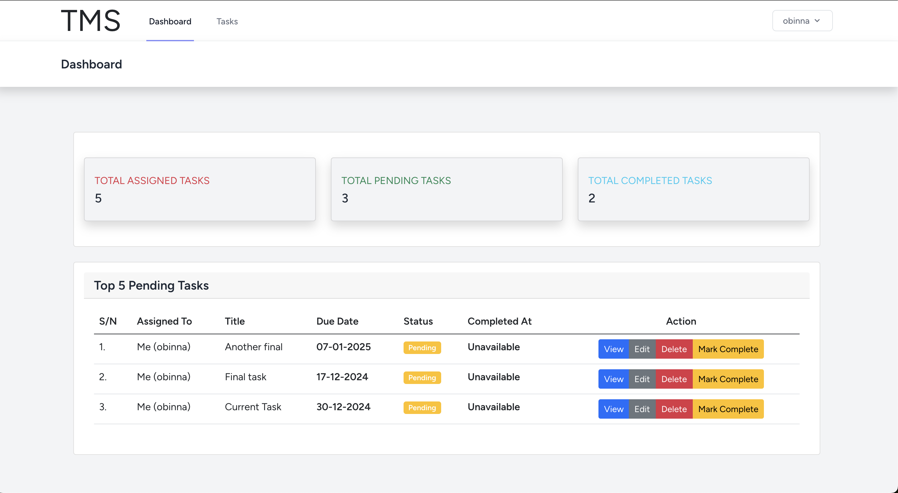
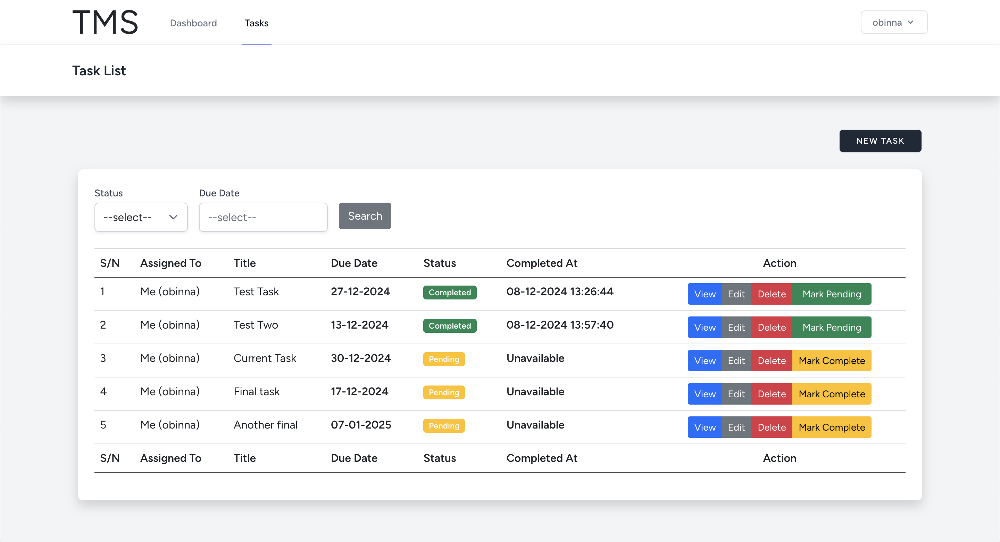
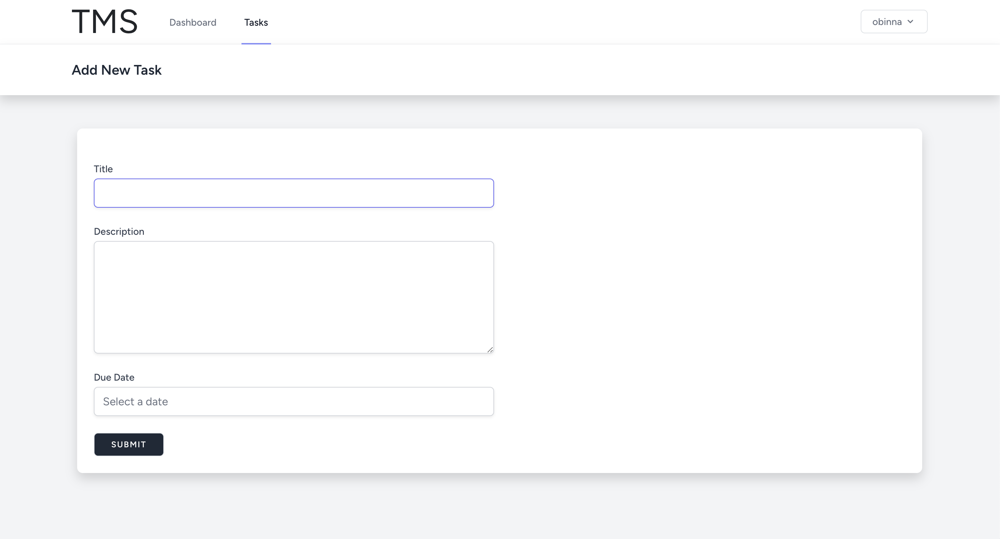

# Task Management System (TMS)

## Objective:
Create a simple Task Management System where users can:

- Log in.
- Create, update, and delete tasks.
- Mark tasks as completed.
- Filter tasks by status (completed or pending).


## Server requirements
- PHP (8.2 or higher)
- Composer (2.8 or higher)
- MySQL 
- A local Webserver such as `XAMPP`, `WAMP`, `LARAGON`, `HERD` or similar are required

## Installation

## Step 1:
Extract this zip file into your local server public directory

```sh
cd extracted folder

cp .env.example .env
```

## OR 

Clone the repo locally in your local server public directory:

```sh
git clone https://github.com/obinosteve/tms.git tms
cd tms
```

Install PHP dependencies:

```sh
composer install
```

Install NPM dependencies:

```sh
npm ci
```

Build assets:

```sh
npm run dev
```

Setup configuration:

```sh
cp .env.example .env
```


## Step 2:
Generate application key:

```sh
php artisan key:generate
```

Create a MYSQL database. You can also use another database (SQLite, Postgres), simply update your configuration accordingly.

Update the `.env` file with the database details created above

Run database migrations:

```sh
php artisan migrate
```

Run the dev server (the output will give the address):

```sh
php artisan serve
```

You're ready to go! Visit TMS in your browser, and click on the `Register` button to register an account

Then login with the newly created account


## Running tests

To run the TMS tests, run:

```
php artisan test
```


# Screenshots
Here are some screenshots of the TMS application:

### Dashboard


### Task list page


### Create a new task


